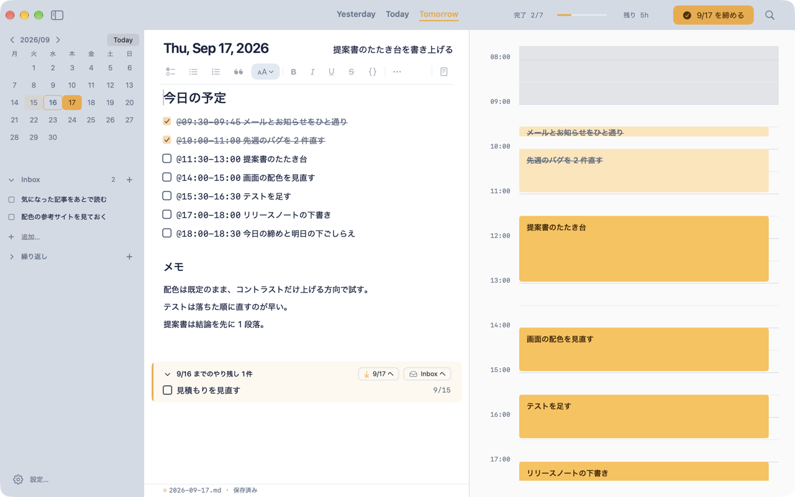

# FirnPlanner

macOS 向けの1日プランナーです。Markdown で書いたタスクが、そのまま1日のタイムラインに並びます。

## できること

- **本文がそのまま予定になる**: `- [ ] 資料をまとめる` のようにチェックボックスの行を書くと、その瞬間にタイムラインへ自動で配置されます。時刻や所要時間を別画面で入力する必要はありません
- **タイムライン表示**: ドラッグで時間を動かす、端をつまんで長さを変える、といった操作で予定を調整できます。1つの時間には1つの予定だけを置く方式で、重なりは自動的に詰め直されます
- **手書き時刻**: `- [ ] @09:30 朝会` のように行頭に時刻を書くと、その行は自動配置の対象から外れて固定されます
- **Inbox**: 日付が決まっていないタスクを溜めておく場所です。あとから好きな日のタイムラインへ振り分けられます
- **やり残しの繰り越し**: 前日までの未完了タスクを、今日のファイルの下にまとめて表示します。今日へ取り込む・Inbox へ送る、を選べます
- **Google カレンダー連携**: 読み取り専用で、カレンダーの予定をタイムラインの横に並べて表示できます (任意)
- **通知**: タスクの開始が近づくと macOS の通知で知らせます (行ごとに設定)
- **1日の締め**: 一日の終わりに振り返りを書き、残った未完了を翌日以降へ送って今日を閉じます
- ファイルの実体は Markdown 1日1ファイルなので、他のエディタやツールでも読み書きできます

## ダウンロード

[Releases](https://github.com/l4l4dev/FirnPlanner/releases) ページから最新版をダウンロードしてください。

## インストール

ダウンロードした dmg を開き、FirnPlanner をアプリケーションフォルダへドラッグしてください。初回起動時、書類フォルダへのアクセスを尋ねられたら許可してください。

## 不具合報告・要望

不具合を見つけた場合や、こういう機能が欲しいという要望は [Issues](https://github.com/l4l4dev/FirnPlanner/issues) からお知らせください。テンプレートに沿って書いていただけると助かります。

## このリポジトリについて

このリポジトリは FirnPlanner の配布とフィードバック受付のための窓口です。開発本体のソースコードは公開していません。
